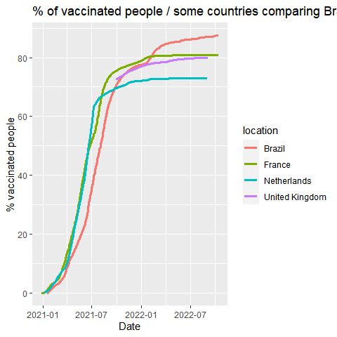

Exploratory Data Analysis - COVID-19
================
Bruno Andrade

## 1. De epidemia a pandemia

<p>

</p>
<p>
Em dezembro de 2019, o coronavírus COVID-19 foi identificado pela
primeira vez na região de Wuhan, na China. Em 11 de março de 2020, a
Organização Mundial da Saúde (OMS) classificou o surto de COVID-19 como
uma pandemia. Muita coisa aconteceu nos meses entre grandes surtos no
Irã, Coréia do Sul e Itália.
</p>
<p>
Sabemos que o COVID-19 se espalha por gotículas respiratórias, como
tosse, espirro ou fala. Mas, com que rapidez o vírus se espalhou pelo
mundo? E podemos ver algum efeito das políticas nacionais, como
paralisações e quarentenas?
</p>
<p>
Felizmente, organizações em todo o mundo coletam dados para que os
governos possam monitorar e aprender com essa pandemia. Notavelmente, o
Centro de Ciência e Engenharia de Sistemas da Universidade Johns Hopkins
criou um
<a href="https://github.com/RamiKrispin/coronavirus">repositório de
dados disponível publicamente</a> para consolidar esses dados de fontes
como a OMS, os Centros de Controle e Prevenção de Doenças (CDC) e o
Ministério da Saúde de vários países.
</p>
<p>
Neste notebook, você visualizará diferentes análises dos dados da
COVID-19 desde as primeiras semanas do surto até 14 de outubro de 2022
</p>
<p>
<em>Observe que informações e dados sobre a COVID-19 são atualizados com
frequência. Os dados usados neste projeto foram extraídos em 14 de
outubro de 2022 e não devem ser considerados os dados mais atualizados
disponíveis.</em>
</p>

``` r
# Importar biblioteca
library(tidyverse)
```

    ## Warning: package 'tidyverse' was built under R version 4.2.1

    ## ── Attaching packages ─────────────────────────────────────── tidyverse 1.3.2 ──
    ## ✔ ggplot2 3.3.6     ✔ purrr   0.3.4
    ## ✔ tibble  3.1.7     ✔ dplyr   1.0.9
    ## ✔ tidyr   1.2.0     ✔ stringr 1.4.1
    ## ✔ readr   2.1.3     ✔ forcats 0.5.2

    ## Warning: package 'ggplot2' was built under R version 4.2.1

    ## Warning: package 'tidyr' was built under R version 4.2.1

    ## Warning: package 'readr' was built under R version 4.2.1

    ## Warning: package 'stringr' was built under R version 4.2.1

    ## Warning: package 'forcats' was built under R version 4.2.1

    ## ── Conflicts ────────────────────────────────────────── tidyverse_conflicts() ──
    ## ✖ dplyr::filter() masks stats::filter()
    ## ✖ dplyr::lag()    masks stats::lag()

``` r
# Ler tabela
data <- read_csv('../datasets/full-covid-data.csv'
                 , col_types=cols(date = col_date("%Y-%m-%d")))

# Examinar tabela
glimpse(data)
```

    ## Rows: 223,556
    ## Columns: 67
    ## $ iso_code                                   <chr> "AFG", "AFG", "AFG", "AFG",…
    ## $ continent                                  <chr> "Asia", "Asia", "Asia", "As…
    ## $ location                                   <chr> "Afghanistan", "Afghanistan…
    ## $ date                                       <date> 2020-02-24, 2020-02-25, 20…
    ## $ total_cases                                <dbl> 5, 5, 5, 5, 5, 5, 5, 5, 5, …
    ## $ new_cases                                  <dbl> 5, 0, 0, 0, 0, 0, 0, 0, 0, …
    ## $ new_cases_smoothed                         <dbl> NA, NA, NA, NA, NA, 0.714, …
    ## $ total_deaths                               <dbl> NA, NA, NA, NA, NA, NA, NA,…
    ## $ new_deaths                                 <dbl> NA, NA, NA, NA, NA, NA, NA,…
    ## $ new_deaths_smoothed                        <dbl> NA, NA, NA, NA, NA, NA, NA,…
    ## $ total_cases_per_million                    <dbl> 0.125, 0.125, 0.125, 0.125,…
    ## $ new_cases_per_million                      <dbl> 0.125, 0.000, 0.000, 0.000,…
    ## $ new_cases_smoothed_per_million             <dbl> NA, NA, NA, NA, NA, 0.018, …
    ## $ total_deaths_per_million                   <dbl> NA, NA, NA, NA, NA, NA, NA,…
    ## $ new_deaths_per_million                     <dbl> NA, NA, NA, NA, NA, NA, NA,…
    ## $ new_deaths_smoothed_per_million            <dbl> NA, NA, NA, NA, NA, NA, NA,…
    ## $ reproduction_rate                          <dbl> NA, NA, NA, NA, NA, NA, NA,…
    ## $ icu_patients                               <dbl> NA, NA, NA, NA, NA, NA, NA,…
    ## $ icu_patients_per_million                   <dbl> NA, NA, NA, NA, NA, NA, NA,…
    ## $ hosp_patients                              <dbl> NA, NA, NA, NA, NA, NA, NA,…
    ## $ hosp_patients_per_million                  <dbl> NA, NA, NA, NA, NA, NA, NA,…
    ## $ weekly_icu_admissions                      <dbl> NA, NA, NA, NA, NA, NA, NA,…
    ## $ weekly_icu_admissions_per_million          <dbl> NA, NA, NA, NA, NA, NA, NA,…
    ## $ weekly_hosp_admissions                     <dbl> NA, NA, NA, NA, NA, NA, NA,…
    ## $ weekly_hosp_admissions_per_million         <dbl> NA, NA, NA, NA, NA, NA, NA,…
    ## $ total_tests                                <dbl> NA, NA, NA, NA, NA, NA, NA,…
    ## $ new_tests                                  <dbl> NA, NA, NA, NA, NA, NA, NA,…
    ## $ total_tests_per_thousand                   <dbl> NA, NA, NA, NA, NA, NA, NA,…
    ## $ new_tests_per_thousand                     <dbl> NA, NA, NA, NA, NA, NA, NA,…
    ## $ new_tests_smoothed                         <dbl> NA, NA, NA, NA, NA, NA, NA,…
    ## $ new_tests_smoothed_per_thousand            <dbl> NA, NA, NA, NA, NA, NA, NA,…
    ## $ positive_rate                              <dbl> NA, NA, NA, NA, NA, NA, NA,…
    ## $ tests_per_case                             <dbl> NA, NA, NA, NA, NA, NA, NA,…
    ## $ tests_units                                <chr> NA, NA, NA, NA, NA, NA, NA,…
    ## $ total_vaccinations                         <dbl> NA, NA, NA, NA, NA, NA, NA,…
    ## $ people_vaccinated                          <dbl> NA, NA, NA, NA, NA, NA, NA,…
    ## $ people_fully_vaccinated                    <dbl> NA, NA, NA, NA, NA, NA, NA,…
    ## $ total_boosters                             <dbl> NA, NA, NA, NA, NA, NA, NA,…
    ## $ new_vaccinations                           <dbl> NA, NA, NA, NA, NA, NA, NA,…
    ## $ new_vaccinations_smoothed                  <dbl> NA, NA, NA, NA, NA, NA, NA,…
    ## $ total_vaccinations_per_hundred             <dbl> NA, NA, NA, NA, NA, NA, NA,…
    ## $ people_vaccinated_per_hundred              <dbl> NA, NA, NA, NA, NA, NA, NA,…
    ## $ people_fully_vaccinated_per_hundred        <dbl> NA, NA, NA, NA, NA, NA, NA,…
    ## $ total_boosters_per_hundred                 <dbl> NA, NA, NA, NA, NA, NA, NA,…
    ## $ new_vaccinations_smoothed_per_million      <dbl> NA, NA, NA, NA, NA, NA, NA,…
    ## $ new_people_vaccinated_smoothed             <dbl> NA, NA, NA, NA, NA, NA, NA,…
    ## $ new_people_vaccinated_smoothed_per_hundred <dbl> NA, NA, NA, NA, NA, NA, NA,…
    ## $ stringency_index                           <dbl> 8.33, 8.33, 8.33, 8.33, 8.3…
    ## $ population                                 <dbl> 40099462, 40099462, 4009946…
    ## $ population_density                         <dbl> 54.422, 54.422, 54.422, 54.…
    ## $ median_age                                 <dbl> 18.6, 18.6, 18.6, 18.6, 18.…
    ## $ aged_65_older                              <dbl> 2.581, 2.581, 2.581, 2.581,…
    ## $ aged_70_older                              <dbl> 1.337, 1.337, 1.337, 1.337,…
    ## $ gdp_per_capita                             <dbl> 1803.987, 1803.987, 1803.98…
    ## $ extreme_poverty                            <dbl> NA, NA, NA, NA, NA, NA, NA,…
    ## $ cardiovasc_death_rate                      <dbl> 597.029, 597.029, 597.029, …
    ## $ diabetes_prevalence                        <dbl> 9.59, 9.59, 9.59, 9.59, 9.5…
    ## $ female_smokers                             <dbl> NA, NA, NA, NA, NA, NA, NA,…
    ## $ male_smokers                               <dbl> NA, NA, NA, NA, NA, NA, NA,…
    ## $ handwashing_facilities                     <dbl> 37.746, 37.746, 37.746, 37.…
    ## $ hospital_beds_per_thousand                 <dbl> 0.5, 0.5, 0.5, 0.5, 0.5, 0.…
    ## $ life_expectancy                            <dbl> 64.83, 64.83, 64.83, 64.83,…
    ## $ human_development_index                    <dbl> 0.511, 0.511, 0.511, 0.511,…
    ## $ excess_mortality_cumulative_absolute       <dbl> NA, NA, NA, NA, NA, NA, NA,…
    ## $ excess_mortality_cumulative                <dbl> NA, NA, NA, NA, NA, NA, NA,…
    ## $ excess_mortality                           <dbl> NA, NA, NA, NA, NA, NA, NA,…
    ## $ excess_mortality_cumulative_per_million    <dbl> NA, NA, NA, NA, NA, NA, NA,…

``` r
colnames(data)
```

    ##  [1] "iso_code"                                  
    ##  [2] "continent"                                 
    ##  [3] "location"                                  
    ##  [4] "date"                                      
    ##  [5] "total_cases"                               
    ##  [6] "new_cases"                                 
    ##  [7] "new_cases_smoothed"                        
    ##  [8] "total_deaths"                              
    ##  [9] "new_deaths"                                
    ## [10] "new_deaths_smoothed"                       
    ## [11] "total_cases_per_million"                   
    ## [12] "new_cases_per_million"                     
    ## [13] "new_cases_smoothed_per_million"            
    ## [14] "total_deaths_per_million"                  
    ## [15] "new_deaths_per_million"                    
    ## [16] "new_deaths_smoothed_per_million"           
    ## [17] "reproduction_rate"                         
    ## [18] "icu_patients"                              
    ## [19] "icu_patients_per_million"                  
    ## [20] "hosp_patients"                             
    ## [21] "hosp_patients_per_million"                 
    ## [22] "weekly_icu_admissions"                     
    ## [23] "weekly_icu_admissions_per_million"         
    ## [24] "weekly_hosp_admissions"                    
    ## [25] "weekly_hosp_admissions_per_million"        
    ## [26] "total_tests"                               
    ## [27] "new_tests"                                 
    ## [28] "total_tests_per_thousand"                  
    ## [29] "new_tests_per_thousand"                    
    ## [30] "new_tests_smoothed"                        
    ## [31] "new_tests_smoothed_per_thousand"           
    ## [32] "positive_rate"                             
    ## [33] "tests_per_case"                            
    ## [34] "tests_units"                               
    ## [35] "total_vaccinations"                        
    ## [36] "people_vaccinated"                         
    ## [37] "people_fully_vaccinated"                   
    ## [38] "total_boosters"                            
    ## [39] "new_vaccinations"                          
    ## [40] "new_vaccinations_smoothed"                 
    ## [41] "total_vaccinations_per_hundred"            
    ## [42] "people_vaccinated_per_hundred"             
    ## [43] "people_fully_vaccinated_per_hundred"       
    ## [44] "total_boosters_per_hundred"                
    ## [45] "new_vaccinations_smoothed_per_million"     
    ## [46] "new_people_vaccinated_smoothed"            
    ## [47] "new_people_vaccinated_smoothed_per_hundred"
    ## [48] "stringency_index"                          
    ## [49] "population"                                
    ## [50] "population_density"                        
    ## [51] "median_age"                                
    ## [52] "aged_65_older"                             
    ## [53] "aged_70_older"                             
    ## [54] "gdp_per_capita"                            
    ## [55] "extreme_poverty"                           
    ## [56] "cardiovasc_death_rate"                     
    ## [57] "diabetes_prevalence"                       
    ## [58] "female_smokers"                            
    ## [59] "male_smokers"                              
    ## [60] "handwashing_facilities"                    
    ## [61] "hospital_beds_per_thousand"                
    ## [62] "life_expectancy"                           
    ## [63] "human_development_index"                   
    ## [64] "excess_mortality_cumulative_absolute"      
    ## [65] "excess_mortality_cumulative"               
    ## [66] "excess_mortality"                          
    ## [67] "excess_mortality_cumulative_per_million"

### Vamos começar com o início da pandemia (22/01 até 22/03 de 2020)

``` r
# Filtrar dados que serão utilizados
confirmed_cases_world_2020 <- data %>% select(location, date, total_cases) %>%
                      filter(location == "World" &  date <= "2020-03-20")

# Ver tabela filtrada
str(confirmed_cases_world_2020)
```

    ## tibble [59 × 3] (S3: tbl_df/tbl/data.frame)
    ##  $ location   : chr [1:59] "World" "World" "World" "World" ...
    ##  $ date       : Date[1:59], format: "2020-01-22" "2020-01-23" ...
    ##  $ total_cases: num [1:59] 557 657 944 1437 2120 ...

``` r
head(confirmed_cases_world_2020)
```

    ## # A tibble: 6 × 3
    ##   location date       total_cases
    ##   <chr>    <date>           <dbl>
    ## 1 World    2020-01-22         557
    ## 2 World    2020-01-23         657
    ## 3 World    2020-01-24         944
    ## 4 World    2020-01-25        1437
    ## 5 World    2020-01-26        2120
    ## 6 World    2020-01-27        2929

## 2. Casos confirmados em todo o mundo

<p>
A tabela acima mostra os casos cumulativos confirmados de COVID-19 em
todo o mundo de 22 de janeiro a 20 de março de 2020. Apenas ler os
números em uma tabela torna difícil ter uma noção da escala e do
crescimento do surto. Vamos desenhar um gráfico de linhas para
visualizar os casos confirmados em todo o mundo.
</p>

``` r
# Remover notação científica
options(scipen=999)

# Gerar gráfico
ggplot(confirmed_cases_world_2020, aes(date, total_cases)) + 
       geom_line() +
       labs(y = "Casos confirmados comulativos"
            , x = "")
```

<!-- -->

## 3. China em comparação com o resto do mundo

<p>
O eixo y nesse gráfico é bastante assustador, com o número total de
casos confirmados em todo o mundo ultrapassando 200.000 em 2 meses. Além
disso, algumas coisas estranhas estão acontecendo: há um salto estranho
em meados de fevereiro, então a taxa de novos casos diminui por um
tempo, depois acelera novamente em março. Precisamos ir mais fundo para
ver o que está acontecendo.
</p>
<p>
No início do surto, os casos de COVID-19 estavam concentrados
principalmente na China. Vamos traçar casos confirmados de COVID-19 na
China e no resto do mundo para entender melhor.
</p>

``` r
# Filtrar dados que serão utilizados
confirmed_cases_china_2020 <- data %>% select(location, date, total_cases) %>%
                      filter(location == "China" &  date <= "2020-03-20")

confirmed_cases_world_no_china <- confirmed_cases_world_2020 %>%
   mutate(total_cases = total_cases - confirmed_cases_china_2020$total_cases)

confirmed_cases_world_vs_china <- rbind(confirmed_cases_china_2020, confirmed_cases_world_no_china)

# Gerar gráfico
confirmed_cases_world_vs_china_graph <- ggplot(confirmed_cases_world_vs_china) +
       geom_line(aes(date, total_cases, color=location)) +
       labs(y = "Casos confirmados comulativos"
            , x = "")
confirmed_cases_world_vs_china_graph
```

<!-- -->

## 4. Vamos anotar!

<p>
As duas linhas têm formas muito diferentes. Em fevereiro, a maioria dos
casos ocorreu na China. Isso mudou em março, quando realmente se tornou
um surto global: por volta de 14 de março, o número total de casos fora
da China ultrapassou os casos dentro da China. Isso foi dias depois que
a OMS declarou uma pandemia.
</p>
<p>
Houve alguns outros eventos marcantes que aconteceram durante o surto.
Por exemplo, o grande salto na linha da China em 13 de fevereiro de 2020
não foi apenas um dia ruim em relação ao surto; A China mudou a maneira
como relatou os números naquele dia (as tomografias foram aceitas como
evidência para COVID-19, em vez de apenas testes de laboratório).
</p>
<p>
Ao anotar eventos como esse, podemos interpretar melhor as mudanças no
gráfico.
</p>

``` r
who_events <- tribble(
  ~ date, ~ event,
  "2020-01-30", "Saúde global\nEmergência declarada",
  "2020-03-11", "Pandemia declarada",
  "2020-02-13", "Relatório de\nmudança da China"
) %>%
  mutate(date = as.Date(date))

# Using who_events, add vertical dashed lines with an xintercept at date
# and text at date, labeled by event, and at 100000 on the y-axis
confirmed_cases_world_vs_china_graph + 
geom_vline(aes(xintercept = date), data=who_events, linetype="dashed") +
geom_text(aes(x=date, label=event)
          , data=who_events, y=1.5e+5, vjust=1, size = 4, angle = 90)
```

<!-- -->

## 5. Adicionando uma linha de tendência à China

<p>
Ao tentar avaliar o tamanho dos problemas futuros, precisamos medir a
rapidez com que o número de casos está crescendo. Um bom ponto de
partida é ver se os casos estão crescendo mais rápido ou mais devagar do
que linearmente.
</p>
<p>
Há um claro aumento de casos por volta de 13 de fevereiro de 2020, com a
mudança de relatórios na China. No entanto, alguns dias depois, o
crescimento de casos na China diminui. Como podemos descrever o
crescimento do COVID-19 na China após 15 de fevereiro de 2020?
</p>

``` r
# Filtrar China, de fev 15
china_after_feb15 <- confirmed_cases_world_vs_china %>% 
                     filter(location=="China" , date >="2020-02-15");

# Adiciona um linha de tendência usando regressão linear, sem error bars
ggplot(china_after_feb15, aes(date, total_cases)) + 
geom_line() +
  geom_smooth(method="lm", se=FALSE) +
  ylab("Cumulative confirmed cases")
```

    ## `geom_smooth()` using formula 'y ~ x'

<!-- -->

## 6. E o resto do mundo?

<p>
No gráfico acima, a taxa de crescimento na China é mais lenta do que
linear. Essa é uma ótima notícia porque indica que a China conteve pelo
menos um pouco o vírus no final de fevereiro e início de março.
</p>
<p>
Como o resto do mundo se compara ao crescimento linear?
</p>

``` r
# Adiciona um linha de tendência usando regressão linear, sem error bars
plt_not_china_trend_lin <- ggplot(confirmed_cases_world_no_china
                                  , aes(date, total_cases)) + 
                           geom_line() +
                           geom_smooth(method="lm", se=FALSE) +
                           labs(y = "Casos confirmados comulativos", x = "")
plt_not_china_trend_lin
```

    ## `geom_smooth()` using formula 'y ~ x'

<!-- -->

## 7. Adicionando uma escala logarítmica

<p>
No gráfico acima, podemos ver que uma linha reta não se encaixa bem, e o
resto do mundo está crescendo muito mais rápido do que linearmente. E se
adicionarmos uma escala logarítmica ao eixo y?
</p>

``` r
# Modifica o gráfico em escala logarítmica no eixo y
plt_not_china_trend_lin + scale_y_log10()
```

    ## `geom_smooth()` using formula 'y ~ x'

<!-- -->

## 8. Quais países fora da China foram os mais atingidos?

<p>
Com a escala logarítmica, temos um ajuste muito mais próximo dos dados.
Do ponto de vista da ciência de dados, um bom ajuste é uma ótima
notícia. Infelizmente, do ponto de vista da saúde pública, isso
significa que os casos de COVID-19 no resto do mundo estão crescendo a
uma taxa exponencial, o que é uma notícia terrível.
</p>
<p>
Nem todos os países estão sendo afetados pelo COVID-19 igualmente, e
seria útil saber em que parte do mundo os problemas são maiores. Vamos
encontrar os países fora da China com mais casos confirmados em nosso
conjunto de dados.
</p>
<p>
<em>Obs: Estou restringindo os dados nos primeiros 2 meses do inicio da
pandemia</em>
</p>

``` r
confirmed_cases_top_country <- data %>% 
                      select(continent,location, date, total_cases) %>%
                      filter(!is.na(continent), location != "China"
                             , date <= "2020-03-20") %>%
                      mutate(total_cases = if_else(is.na(total_cases)
                                                   , 0, total_cases)) %>%
                      group_by(location) %>%
                      summarise(total_cases = max(total_cases)) %>%
                      top_n(8, total_cases) %>%
                      arrange(-total_cases)

confirmed_cases_top_country
```

    ## # A tibble: 8 × 2
    ##   location       total_cases
    ##   <chr>                <dbl>
    ## 1 Italy                47021
    ## 2 Spain                20410
    ## 3 United States        20030
    ## 4 Iran                 19644
    ## 5 Germany              13957
    ## 6 France               12745
    ## 7 South Korea           8652
    ## 8 United Kingdom        7760

## 9. Traçar os países mais atingidos em meados de março de 2020

<p>
Embora o surto tenha sido identificado pela primeira vez na China, há
apenas um país do Leste Asiático (Coreia do Sul) na tabela acima. Quatro
dos países listados (França, Alemanha, Itália e Espanha) estão na Europa
e compartilham fronteiras. Para obter mais contexto, podemos traçar os
casos confirmados desses países ao longo do tempo.
</p>
<p>
Se você quiser continuar fazendo visualizações ou encontrar os países
mais atingidos a partir de hoje, você pode fazer suas próprias análises
com os dados mais recentes disponíveis no
<a href="https://github.com/RamiKrispin/coronavirus"> Github (Rami
Krispin) \</ a\> ou <a href="https://ourworldindata.org/coronavirus">Our
World in Data\</ a\>.
</p>

``` r
top10 <- c("Italy", "Spain", "United States", "Iran"
                           , "Germany", "France", "South Korea"
                           , "United Kingdom")
confirmed_cases_top10_outside_china <- data %>% 
                  select(location, date, total_cases)  %>% 
                  filter(location %in% top10 & date <= "2020-03-20")

# Using confirmed_cases_top7_outside_china, draw a line plot of
# cum_cases vs. date, colored by country
ggplot(confirmed_cases_top10_outside_china) +
geom_line(aes(date, total_cases, colour=location)) +
labs(y = "Casos confirmados comulativos", x = "")
```

    ## Warning: Removed 1 row(s) containing missing values (geom_path).

<!-- -->

# Outras Análises

``` r
library(data.table)
```

    ## Warning: package 'data.table' was built under R version 4.2.1

    ## 
    ## Attaching package: 'data.table'

    ## The following objects are masked from 'package:dplyr':
    ## 
    ##     between, first, last

    ## The following object is masked from 'package:purrr':
    ## 
    ##     transpose

``` r
library(funModeling)
```

    ## Warning: package 'funModeling' was built under R version 4.2.1

    ## Carregando pacotes exigidos: Hmisc

    ## Warning: package 'Hmisc' was built under R version 4.2.1

    ## Carregando pacotes exigidos: lattice

    ## Carregando pacotes exigidos: survival

    ## Carregando pacotes exigidos: Formula

    ## 
    ## Attaching package: 'Hmisc'

    ## The following objects are masked from 'package:dplyr':
    ## 
    ##     src, summarize

    ## The following objects are masked from 'package:base':
    ## 
    ##     format.pval, units

    ## funModeling v.1.9.4 :)
    ## Examples and tutorials at livebook.datascienceheroes.com
    ##  / Now in Spanish: librovivodecienciadedatos.ai

``` r
library(Hmisc)
library(ggplot2)

data <- fread("../datasets/full-covid-data.csv")

# View(data)
```

``` r
# ===============================================================
#   1. Checar valores faltando, zeros, tipo de dados e valores únicos
#       (missing values, zeros, data type, unique values) 
# ===============================================================

# total rows, total columns
nrow(data)
```

    ## [1] 223556

``` r
ncol(data)
```

    ## [1] 67

``` r
# basic profiling
df_status(data)
```

    ##                                      variable q_zeros p_zeros   q_na  p_na
    ## 1                                    iso_code       0    0.00      0  0.00
    ## 2                                   continent       0    0.00      0  0.00
    ## 3                                    location       0    0.00      0  0.00
    ## 4                                        date       0    0.00      0  0.00
    ## 5                                 total_cases       0    0.00   9176  4.10
    ## 6                                   new_cases   62486   27.95   9401  4.21
    ## 7                          new_cases_smoothed   21360    9.55  10597  4.74
    ## 8                                total_deaths       0    0.00  28332 12.67
    ## 9                                  new_deaths   93350   41.76  28373 12.69
    ## 10                        new_deaths_smoothed   50084   22.40  29553 13.22
    ## 11                    total_cases_per_million       0    0.00  10156  4.54
    ## 12                      new_cases_per_million   61529   27.52  10381  4.64
    ## 13             new_cases_smoothed_per_million   20482    9.16  11572  5.18
    ## 14                   total_deaths_per_million      17    0.01  29299 13.11
    ## 15                     new_deaths_per_million   92400   41.33  29340 13.12
    ## 16            new_deaths_smoothed_per_million   49291   22.05  30515 13.65
    ## 17                          reproduction_rate    2151    0.96  56839 25.42
    ## 18                               icu_patients     593    0.27 195180 87.31
    ## 19                   icu_patients_per_million     593    0.27 195180 87.31
    ## 20                              hosp_patients     153    0.07 192404 86.07
    ## 21                  hosp_patients_per_million     153    0.07 192404 86.07
    ## 22                      weekly_icu_admissions      76    0.03 216196 96.71
    ## 23          weekly_icu_admissions_per_million      76    0.03 216196 96.71
    ## 24                     weekly_hosp_admissions      49    0.02 209178 93.57
    ## 25         weekly_hosp_admissions_per_million      49    0.02 209178 93.57
    ## 26                                total_tests       1    0.00 144169 64.49
    ## 27                                  new_tests       0    0.00 148153 66.27
    ## 28                   total_tests_per_thousand      51    0.02 144169 64.49
    ## 29                     new_tests_per_thousand     212    0.09 148153 66.27
    ## 30                         new_tests_smoothed     185    0.08 119591 53.49
    ## 31            new_tests_smoothed_per_thousand     534    0.24 119591 53.49
    ## 32                              positive_rate    2197    0.98 127629 57.09
    ## 33                             tests_per_case       0    0.00 129208 57.80
    ## 34                                tests_units       0    0.00      0  0.00
    ## 35                         total_vaccinations     130    0.06 161224 72.12
    ## 36                          people_vaccinated     126    0.06 163946 73.34
    ## 37                    people_fully_vaccinated       0    0.00 166724 74.58
    ## 38                             total_boosters       0    0.00 190352 85.15
    ## 39                           new_vaccinations     140    0.06 172362 77.10
    ## 40                  new_vaccinations_smoothed    1774    0.79  93744 41.93
    ## 41             total_vaccinations_per_hundred     341    0.15 161224 72.12
    ## 42              people_vaccinated_per_hundred     379    0.17 163946 73.34
    ## 43        people_fully_vaccinated_per_hundred     816    0.37 166724 74.58
    ## 44                 total_boosters_per_hundred    4464    2.00 190352 85.15
    ## 45      new_vaccinations_smoothed_per_million    1920    0.86  93744 41.93
    ## 46             new_people_vaccinated_smoothed    4105    1.84  94454 42.25
    ## 47 new_people_vaccinated_smoothed_per_hundred    6819    3.05  94454 42.25
    ## 48                           stringency_index     596    0.27  55261 24.72
    ## 49                                 population       0    0.00   1297  0.58
    ## 50                         population_density       0    0.00  24992 11.18
    ## 51                                 median_age       0    0.00  39828 17.82
    ## 52                              aged_65_older       0    0.00  41767 18.68
    ## 53                              aged_70_older       0    0.00  40789 18.25
    ## 54                             gdp_per_capita       0    0.00  40441 18.09
    ## 55                            extreme_poverty       0    0.00 104258 46.64
    ## 56                      cardiovasc_death_rate       0    0.00  40320 18.04
    ## 57                        diabetes_prevalence       0    0.00  30915 13.83
    ## 58                             female_smokers       0    0.00  84850 37.95
    ## 59                               male_smokers       0    0.00  86749 38.80
    ## 60                     handwashing_facilities       0    0.00 133357 59.65
    ## 61                 hospital_beds_per_thousand       0    0.00  60481 27.05
    ## 62                            life_expectancy       0    0.00  14658  6.56
    ## 63                    human_development_index       0    0.00  44824 20.05
    ## 64       excess_mortality_cumulative_absolute       0    0.00 216096 96.66
    ## 65                excess_mortality_cumulative       1    0.00 216096 96.66
    ## 66                           excess_mortality       5    0.00 216049 96.64
    ## 67    excess_mortality_cumulative_per_million       0    0.00 216096 96.66
    ##    q_inf p_inf       type unique
    ## 1      0     0  character    244
    ## 2      0     0  character      7
    ## 3      0     0  character    244
    ## 4      0     0 IDate-Date   1017
    ## 5      0     0    numeric 114778
    ## 6      0     0    numeric  26765
    ## 7      0     0    numeric  48058
    ## 8      0     0    numeric  44977
    ## 9      0     0    numeric   4558
    ## 10     0     0    numeric  11341
    ## 11     0     0    numeric 150235
    ## 12     0     0    numeric  79704
    ## 13     0     0    numeric  91942
    ## 14     0     0    numeric  94667
    ## 15     0     0    numeric   9630
    ## 16     0     0    numeric  11102
    ## 17     0     0    numeric    385
    ## 18     0     0    numeric   3952
    ## 19     0     0    numeric  12094
    ## 20     0     0    numeric   9099
    ## 21     0     0    numeric  21958
    ## 22     0     0    numeric   1643
    ## 23     0     0    numeric   3818
    ## 24     0     0    numeric   6785
    ## 25     0     0    numeric  11727
    ## 26     0     0    numeric  78045
    ## 27     0     0    numeric  38683
    ## 28     0     0    numeric  72348
    ## 29     0     0    numeric  12374
    ## 30     0     0    numeric  44392
    ## 31     0     0    numeric  13002
    ## 32     0     0    numeric   5171
    ## 33     0     0    numeric   7077
    ## 34     0     0  character      5
    ## 35     0     0    numeric  61439
    ## 36     0     0    numeric  58146
    ## 37     0     0    numeric  55078
    ## 38     0     0    numeric  28837
    ## 39     0     0    numeric  38288
    ## 40     0     0    numeric  54014
    ## 41     0     0    numeric  22529
    ## 42     0     0    numeric   9597
    ## 43     0     0    numeric   9343
    ## 44     0     0    numeric   7655
    ## 45     0     0    numeric  12516
    ## 46     0     0    numeric  39400
    ## 47     0     0    numeric   1400
    ## 48     0     0    numeric   4323
    ## 49     0     0    numeric    242
    ## 50     0     0    numeric    213
    ## 51     0     0    numeric    139
    ## 52     0     0    numeric    192
    ## 53     0     0    numeric    191
    ## 54     0     0    numeric    196
    ## 55     0     0    numeric     76
    ## 56     0     0    numeric    195
    ## 57     0     0    numeric    150
    ## 58     0     0    numeric    112
    ## 59     0     0    numeric    127
    ## 60     0     0    numeric     96
    ## 61     0     0    numeric    102
    ## 62     0     0    numeric    213
    ## 63     0     0    numeric    154
    ## 64     0     0    numeric   7225
    ## 65     0     0    numeric   3470
    ## 66     0     0    numeric   4268
    ## 67     0     0    numeric   7431

``` r
# data[, lapply(.SD, function(x) sum(is.na(x)))] count NA
# data[, lapply(.SD, function(x) sum(is.na(x))/ nrow(data))] count percent NA
```

``` r
# profiling categorical variables
freq(data)
```

    ## Warning in freq_logic(data = data, input = input[i], plot, na.rm, path_out =
    ## path_out): Skipping plot for variable 'iso_code' (more than 100 categories)

    ##     iso_code frequency percentage cumulative_perc
    ## 1        ARG      1017       0.45            0.45
    ## 2        MEX      1017       0.45            0.90
    ## 3        THA      1014       0.45            1.35
    ## 4        TWN      1002       0.45            1.80
    ## 5        CHN       996       0.45            2.25
    ## 6        JPN       996       0.45            2.70
    ## 7        KOR       996       0.45            3.15
    ## 8        MAC       996       0.45            3.60
    ## 9   OWID_ASI       996       0.45            4.05
    ## 10  OWID_HIC       996       0.45            4.50
    ## 11  OWID_LMC       996       0.45            4.95
    ## 12  OWID_NAM       996       0.45            5.40
    ## 13  OWID_UMC       996       0.45            5.85
    ## 14  OWID_WRL       996       0.45            6.30
    ## 15       USA       996       0.45            6.75
    ## 16       CAN       995       0.45            7.20
    ## 17       HKG       995       0.45            7.65
    ## 18  OWID_EUN       995       0.45            8.10
    ## 19  OWID_EUR       995       0.45            8.55
    ## 20       SGP       995       0.45            9.00
    ## 21       VNM       995       0.45            9.45
    ## 22       FRA       994       0.44            9.89
    ## 23       MYS       994       0.44           10.33
    ## 24       NPL       993       0.44           10.77
    ## 25  OWID_OCE       993       0.44           11.21
    ## 26       AUS       992       0.44           11.65
    ## 27       DEU       991       0.44           12.09
    ## 28       KHM       991       0.44           12.53
    ## 29       LKA       991       0.44           12.97
    ## 30       ARE       989       0.44           13.41
    ## 31       FIN       989       0.44           13.85
    ## 32       FJI       988       0.44           14.29
    ## 33       GBR       988       0.44           14.73
    ## 34       IND       988       0.44           15.17
    ## 35       PHL       988       0.44           15.61
    ## 36       ITA       987       0.44           16.05
    ## 37       RUS       987       0.44           16.49
    ## 38       ESP       986       0.44           16.93
    ## 39       SWE       986       0.44           17.37
    ## 40       DNK       985       0.44           17.81
    ## 41       SVN       985       0.44           18.25
    ## 42       ARM       984       0.44           18.69
    ## 43       EST       984       0.44           19.13
    ## 44       BEL       983       0.44           19.57
    ## 45       MAR       980       0.44           20.01
    ## 46  OWID_INT       980       0.44           20.45
    ## 47       ZAF       980       0.44           20.89
    ## 48  OWID_AFR       974       0.44           21.33
    ## 49       EGY       973       0.44           21.77
    ## 50       GTM       970       0.43           22.20
    ## 51       IRN       968       0.43           22.63
    ## 52       ISR       967       0.43           23.06
    ## 53       LBN       966       0.43           23.49
    ## 54  OWID_SAM       965       0.43           23.92
    ## 55       CHL       964       0.43           24.35
    ## 56       GRC       964       0.43           24.78
    ## 57  OWID_LIC       964       0.43           25.21
    ## 58       AFG       963       0.43           25.64
    ## 59       BHR       963       0.43           26.07
    ## 60       IRQ       963       0.43           26.50
    ## 61       KWT       963       0.43           26.93
    ## 62       LUX       963       0.43           27.36
    ## 63       OMN       963       0.43           27.79
    ## 64       ALB       962       0.43           28.22
    ## 65       AUT       962       0.43           28.65
    ## 66       CHE       962       0.43           29.08
    ## 67       DZA       962       0.43           29.51
    ## 68       HRV       962       0.43           29.94
    ## 69       NOR       962       0.43           30.37
    ## 70       PAK       962       0.43           30.80
    ## 71       BRA       961       0.43           31.23
    ## 72       GEO       961       0.43           31.66
    ## 73       LVA       961       0.43           32.09
    ## 74       MKD       961       0.43           32.52
    ## 75       ROU       961       0.43           32.95
    ## 76       SRB       961       0.43           33.38
    ## 77       NLD       960       0.43           33.81
    ## 78       BLR       959       0.43           34.24
    ## 79       ISL       959       0.43           34.67
    ## 80       NGA       959       0.43           35.10
    ## 81       NZL       959       0.43           35.53
    ## 82       SEN       959       0.43           35.96
    ## 83       IRL       958       0.43           36.39
    ## 84       MCO       958       0.43           36.82
    ## 85       QAT       958       0.43           37.25
    ## 86       SMR       958       0.43           37.68
    ## 87       AZE       957       0.43           38.11
    ## 88       CZE       957       0.43           38.54
    ## 89       DOM       957       0.43           38.97
    ## 90       ECU       957       0.43           39.40
    ## 91       PRT       957       0.43           39.83
    ## 92       AND       956       0.43           40.26
    ## 93       IDN       956       0.43           40.69
    ## 94       SAU       956       0.43           41.12
    ## 95       HUN       955       0.43           41.55
    ## 96       JOR       955       0.43           41.98
    ## 97       UKR       955       0.43           42.41
    ## 98       FRO       954       0.43           42.84
    ## 99       GIB       954       0.43           43.27
    ## 100      LBY       954       0.43           43.70
    ## 101      LIE       954       0.43           44.13
    ## 102      POL       954       0.43           44.56
    ## 103      TGO       954       0.43           44.99
    ## 104      TUN       954       0.43           45.42
    ## 105      BIH       953       0.43           45.85
    ## 106      MLT       953       0.43           46.28
    ## 107      PSE       953       0.43           46.71
    ## 108      BTN       952       0.43           47.14
    ## 109      CMR       952       0.43           47.57
    ## 110      COL       952       0.43           48.00
    ## 111      CRI       952       0.43           48.43
    ## 112      KEN       952       0.43           48.86
    ## 113      PER       952       0.43           49.29
    ## 114      SVK       952       0.43           49.72
    ## 115      VAT       952       0.43           50.15
    ## 116      PRY       951       0.43           50.58
    ## 117      BGD       950       0.42           51.00
    ## 118      BGR       950       0.42           51.42
    ## 119      MDA       950       0.42           51.84
    ## 120      MDV       950       0.42           52.26
    ## 121      BRN       949       0.42           52.68
    ## 122      CYP       949       0.42           53.10
    ## 123      PAN       949       0.42           53.52
    ## 124      BFA       948       0.42           53.94
    ## 125      MNG       948       0.42           54.36
    ## 126      BOL       947       0.42           54.78
    ## 127      CIV       947       0.42           55.20
    ## 128      COD       947       0.42           55.62
    ## 129      HND       947       0.42           56.04
    ## 130      JAM       947       0.42           56.46
    ## 131      TUR       947       0.42           56.88
    ## 132      CUB       946       0.42           57.30
    ## 133      GUY       946       0.42           57.72
    ## 134      ABW       945       0.42           58.14
    ## 135      ATG       945       0.42           58.56
    ## 136      CYM       945       0.42           58.98
    ## 137      ETH       945       0.42           59.40
    ## 138      GIN       945       0.42           59.82
    ## 139      KAZ       945       0.42           60.24
    ## 140      PYF       945       0.42           60.66
    ## 141      SDN       945       0.42           61.08
    ## 142      URY       945       0.42           61.50
    ## 143      CUW       944       0.42           61.92
    ## 144      GAB       944       0.42           62.34
    ## 145      GHA       944       0.42           62.76
    ## 146      LCA       944       0.42           63.18
    ## 147      MRT       944       0.42           63.60
    ## 148      NAM       944       0.42           64.02
    ## 149 OWID_KOS       944       0.42           64.44
    ## 150      RWA       944       0.42           64.86
    ## 151      SUR       944       0.42           65.28
    ## 152      SWZ       944       0.42           65.70
    ## 153      TTO       944       0.42           66.12
    ## 154      VCT       944       0.42           66.54
    ## 155      VEN       944       0.42           66.96
    ## 156      CAF       943       0.42           67.38
    ## 157      COG       943       0.42           67.80
    ## 158      GNQ       943       0.42           68.22
    ## 159      SYC       943       0.42           68.64
    ## 160      UZB       943       0.42           69.06
    ## 161      BEN       942       0.42           69.48
    ## 162      BHS       942       0.42           69.90
    ## 163      GRL       942       0.42           70.32
    ## 164      SOM       942       0.42           70.74
    ## 165      TZA       942       0.42           71.16
    ## 166      BRB       941       0.42           71.58
    ## 167      GMB       941       0.42           72.00
    ## 168      LBR       941       0.42           72.42
    ## 169      MNE       941       0.42           72.84
    ## 170      DJI       940       0.42           73.26
    ## 171      KGZ       940       0.42           73.68
    ## 172      MSR       940       0.42           74.10
    ## 173      MUS       940       0.42           74.52
    ## 174      ZMB       940       0.42           74.94
    ## 175      BMU       939       0.42           75.36
    ## 176      LTU       939       0.42           75.78
    ## 177      NCL       939       0.42           76.20
    ## 178      NIC       939       0.42           76.62
    ## 179      SLV       939       0.42           77.04
    ## 180      TCD       939       0.42           77.46
    ## 181      AGO       938       0.42           77.88
    ## 182      CPV       938       0.42           78.30
    ## 183      HTI       938       0.42           78.72
    ## 184      IMN       938       0.42           79.14
    ## 185      MDG       938       0.42           79.56
    ## 186      NER       938       0.42           79.98
    ## 187      PNG       938       0.42           80.40
    ## 188      ZWE       938       0.42           80.82
    ## 189      ERI       937       0.42           81.24
    ## 190      UGA       937       0.42           81.66
    ## 191      DMA       936       0.42           82.08
    ## 192      GRD       936       0.42           82.50
    ## 193      MOZ       936       0.42           82.92
    ## 194      SYR       936       0.42           83.34
    ## 195      TLS       936       0.42           83.76
    ## 196      BLZ       935       0.42           84.18
    ## 197      LAO       934       0.42           84.60
    ## 198      GNB       933       0.42           85.02
    ## 199      KNA       933       0.42           85.44
    ## 200      MLI       933       0.42           85.86
    ## 201      MMR       931       0.42           86.28
    ## 202      AIA       930       0.42           86.70
    ## 203      TCA       930       0.42           87.12
    ## 204      VGB       930       0.42           87.54
    ## 205      MWI       929       0.42           87.96
    ## 206      BWA       928       0.42           88.38
    ## 207      BDI       927       0.41           88.79
    ## 208      SLE       927       0.41           89.20
    ## 209      BES       925       0.41           89.61
    ## 210      FLK       923       0.41           90.02
    ## 211      SPM       922       0.41           90.43
    ## 212      SSD       922       0.41           90.84
    ## 213      STP       921       0.41           91.25
    ## 214      YEM       917       0.41           91.66
    ## 215      COM       897       0.40           92.06
    ## 216      TJK       896       0.40           92.46
    ## 217      MHL       890       0.40           92.86
    ## 218      LSO       884       0.40           93.26
    ## 219      PRK       882       0.39           93.65
    ## 220      PRI       840       0.38           94.03
    ## 221      GUM       829       0.37           94.40
    ## 222      VIR       818       0.37           94.77
    ## 223      SHN       767       0.34           95.11
    ## 224      SLB       732       0.33           95.44
    ## 225      WLF       725       0.32           95.76
    ## 226      VUT       703       0.31           96.07
    ## 227      WSM       695       0.31           96.38
    ## 228      FSM       631       0.28           96.66
    ## 229      MNP       610       0.27           96.93
    ## 230      JEY       575       0.26           97.19
    ## 231      NRU       554       0.25           97.44
    ## 232      TKM       554       0.25           97.69
    ## 233      TON       542       0.24           97.93
    ## 234      GGY       535       0.24           98.17
    ## 235      TUV       535       0.24           98.41
    ## 236      SXM       519       0.23           98.64
    ## 237      KIR       514       0.23           98.87
    ## 238      COK       511       0.23           99.10
    ## 239      PCN       441       0.20           99.30
    ## 240      PLW       418       0.19           99.49
    ## 241      TKL       414       0.19           99.68
    ## 242      NIU       408       0.18           99.86
    ## 243 OWID_CYN       317       0.14          100.00
    ## 244      ESH         1       0.00          100.00

    ## Warning: `guides(<scale> = FALSE)` is deprecated. Please use `guides(<scale> =
    ## "none")` instead.

    ##       continent frequency percentage cumulative_perc
    ## 1        Africa     51628      23.09           23.09
    ## 2        Europe     48305      21.61           44.70
    ## 3          Asia     48104      21.52           66.22
    ## 4 North America     34361      15.37           81.59
    ## 5       Oceania     15913       7.12           88.71
    ## 6                   12842       5.74           94.45
    ## 7 South America     12403       5.55          100.00

    ## Warning in freq_logic(data = data, input = input[i], plot, na.rm, path_out =
    ## path_out): Skipping plot for variable 'location' (more than 100 categories)

    ##                             location frequency percentage cumulative_perc
    ## 1                          Argentina      1017       0.45            0.45
    ## 2                             Mexico      1017       0.45            0.90
    ## 3                           Thailand      1014       0.45            1.35
    ## 4                             Taiwan      1002       0.45            1.80
    ## 5                               Asia       996       0.45            2.25
    ## 6                              China       996       0.45            2.70
    ## 7                        High income       996       0.45            3.15
    ## 8                              Japan       996       0.45            3.60
    ## 9                Lower middle income       996       0.45            4.05
    ## 10                             Macao       996       0.45            4.50
    ## 11                     North America       996       0.45            4.95
    ## 12                       South Korea       996       0.45            5.40
    ## 13                     United States       996       0.45            5.85
    ## 14               Upper middle income       996       0.45            6.30
    ## 15                             World       996       0.45            6.75
    ## 16                            Canada       995       0.45            7.20
    ## 17                            Europe       995       0.45            7.65
    ## 18                    European Union       995       0.45            8.10
    ## 19                         Hong Kong       995       0.45            8.55
    ## 20                         Singapore       995       0.45            9.00
    ## 21                           Vietnam       995       0.45            9.45
    ## 22                            France       994       0.44            9.89
    ## 23                          Malaysia       994       0.44           10.33
    ## 24                             Nepal       993       0.44           10.77
    ## 25                           Oceania       993       0.44           11.21
    ## 26                         Australia       992       0.44           11.65
    ## 27                          Cambodia       991       0.44           12.09
    ## 28                           Germany       991       0.44           12.53
    ## 29                         Sri Lanka       991       0.44           12.97
    ## 30                           Finland       989       0.44           13.41
    ## 31              United Arab Emirates       989       0.44           13.85
    ## 32                              Fiji       988       0.44           14.29
    ## 33                             India       988       0.44           14.73
    ## 34                       Philippines       988       0.44           15.17
    ## 35                    United Kingdom       988       0.44           15.61
    ## 36                             Italy       987       0.44           16.05
    ## 37                            Russia       987       0.44           16.49
    ## 38                             Spain       986       0.44           16.93
    ## 39                            Sweden       986       0.44           17.37
    ## 40                           Denmark       985       0.44           17.81
    ## 41                          Slovenia       985       0.44           18.25
    ## 42                           Armenia       984       0.44           18.69
    ## 43                           Estonia       984       0.44           19.13
    ## 44                           Belgium       983       0.44           19.57
    ## 45                     International       980       0.44           20.01
    ## 46                           Morocco       980       0.44           20.45
    ## 47                      South Africa       980       0.44           20.89
    ## 48                            Africa       974       0.44           21.33
    ## 49                             Egypt       973       0.44           21.77
    ## 50                         Guatemala       970       0.43           22.20
    ## 51                              Iran       968       0.43           22.63
    ## 52                            Israel       967       0.43           23.06
    ## 53                           Lebanon       966       0.43           23.49
    ## 54                     South America       965       0.43           23.92
    ## 55                             Chile       964       0.43           24.35
    ## 56                            Greece       964       0.43           24.78
    ## 57                        Low income       964       0.43           25.21
    ## 58                       Afghanistan       963       0.43           25.64
    ## 59                           Bahrain       963       0.43           26.07
    ## 60                              Iraq       963       0.43           26.50
    ## 61                            Kuwait       963       0.43           26.93
    ## 62                        Luxembourg       963       0.43           27.36
    ## 63                              Oman       963       0.43           27.79
    ## 64                           Albania       962       0.43           28.22
    ## 65                           Algeria       962       0.43           28.65
    ## 66                           Austria       962       0.43           29.08
    ## 67                           Croatia       962       0.43           29.51
    ## 68                            Norway       962       0.43           29.94
    ## 69                          Pakistan       962       0.43           30.37
    ## 70                       Switzerland       962       0.43           30.80
    ## 71                            Brazil       961       0.43           31.23
    ## 72                           Georgia       961       0.43           31.66
    ## 73                            Latvia       961       0.43           32.09
    ## 74                   North Macedonia       961       0.43           32.52
    ## 75                           Romania       961       0.43           32.95
    ## 76                            Serbia       961       0.43           33.38
    ## 77                       Netherlands       960       0.43           33.81
    ## 78                           Belarus       959       0.43           34.24
    ## 79                           Iceland       959       0.43           34.67
    ## 80                       New Zealand       959       0.43           35.10
    ## 81                           Nigeria       959       0.43           35.53
    ## 82                           Senegal       959       0.43           35.96
    ## 83                           Ireland       958       0.43           36.39
    ## 84                            Monaco       958       0.43           36.82
    ## 85                             Qatar       958       0.43           37.25
    ## 86                        San Marino       958       0.43           37.68
    ## 87                        Azerbaijan       957       0.43           38.11
    ## 88                           Czechia       957       0.43           38.54
    ## 89                Dominican Republic       957       0.43           38.97
    ## 90                           Ecuador       957       0.43           39.40
    ## 91                          Portugal       957       0.43           39.83
    ## 92                           Andorra       956       0.43           40.26
    ## 93                         Indonesia       956       0.43           40.69
    ## 94                      Saudi Arabia       956       0.43           41.12
    ## 95                           Hungary       955       0.43           41.55
    ## 96                            Jordan       955       0.43           41.98
    ## 97                           Ukraine       955       0.43           42.41
    ## 98                    Faeroe Islands       954       0.43           42.84
    ## 99                         Gibraltar       954       0.43           43.27
    ## 100                            Libya       954       0.43           43.70
    ## 101                    Liechtenstein       954       0.43           44.13
    ## 102                           Poland       954       0.43           44.56
    ## 103                             Togo       954       0.43           44.99
    ## 104                          Tunisia       954       0.43           45.42
    ## 105           Bosnia and Herzegovina       953       0.43           45.85
    ## 106                            Malta       953       0.43           46.28
    ## 107                        Palestine       953       0.43           46.71
    ## 108                           Bhutan       952       0.43           47.14
    ## 109                         Cameroon       952       0.43           47.57
    ## 110                         Colombia       952       0.43           48.00
    ## 111                       Costa Rica       952       0.43           48.43
    ## 112                            Kenya       952       0.43           48.86
    ## 113                             Peru       952       0.43           49.29
    ## 114                         Slovakia       952       0.43           49.72
    ## 115                          Vatican       952       0.43           50.15
    ## 116                         Paraguay       951       0.43           50.58
    ## 117                       Bangladesh       950       0.42           51.00
    ## 118                         Bulgaria       950       0.42           51.42
    ## 119                         Maldives       950       0.42           51.84
    ## 120                          Moldova       950       0.42           52.26
    ## 121                           Brunei       949       0.42           52.68
    ## 122                           Cyprus       949       0.42           53.10
    ## 123                           Panama       949       0.42           53.52
    ## 124                     Burkina Faso       948       0.42           53.94
    ## 125                         Mongolia       948       0.42           54.36
    ## 126                          Bolivia       947       0.42           54.78
    ## 127                    Cote d'Ivoire       947       0.42           55.20
    ## 128     Democratic Republic of Congo       947       0.42           55.62
    ## 129                         Honduras       947       0.42           56.04
    ## 130                          Jamaica       947       0.42           56.46
    ## 131                           Turkey       947       0.42           56.88
    ## 132                             Cuba       946       0.42           57.30
    ## 133                           Guyana       946       0.42           57.72
    ## 134              Antigua and Barbuda       945       0.42           58.14
    ## 135                            Aruba       945       0.42           58.56
    ## 136                   Cayman Islands       945       0.42           58.98
    ## 137                         Ethiopia       945       0.42           59.40
    ## 138                 French Polynesia       945       0.42           59.82
    ## 139                           Guinea       945       0.42           60.24
    ## 140                       Kazakhstan       945       0.42           60.66
    ## 141                            Sudan       945       0.42           61.08
    ## 142                          Uruguay       945       0.42           61.50
    ## 143                          Curacao       944       0.42           61.92
    ## 144                         Eswatini       944       0.42           62.34
    ## 145                            Gabon       944       0.42           62.76
    ## 146                            Ghana       944       0.42           63.18
    ## 147                           Kosovo       944       0.42           63.60
    ## 148                       Mauritania       944       0.42           64.02
    ## 149                          Namibia       944       0.42           64.44
    ## 150                           Rwanda       944       0.42           64.86
    ## 151                      Saint Lucia       944       0.42           65.28
    ## 152 Saint Vincent and the Grenadines       944       0.42           65.70
    ## 153                         Suriname       944       0.42           66.12
    ## 154              Trinidad and Tobago       944       0.42           66.54
    ## 155                        Venezuela       944       0.42           66.96
    ## 156         Central African Republic       943       0.42           67.38
    ## 157                            Congo       943       0.42           67.80
    ## 158                Equatorial Guinea       943       0.42           68.22
    ## 159                       Seychelles       943       0.42           68.64
    ## 160                       Uzbekistan       943       0.42           69.06
    ## 161                          Bahamas       942       0.42           69.48
    ## 162                            Benin       942       0.42           69.90
    ## 163                        Greenland       942       0.42           70.32
    ## 164                          Somalia       942       0.42           70.74
    ## 165                         Tanzania       942       0.42           71.16
    ## 166                         Barbados       941       0.42           71.58
    ## 167                           Gambia       941       0.42           72.00
    ## 168                          Liberia       941       0.42           72.42
    ## 169                       Montenegro       941       0.42           72.84
    ## 170                         Djibouti       940       0.42           73.26
    ## 171                       Kyrgyzstan       940       0.42           73.68
    ## 172                        Mauritius       940       0.42           74.10
    ## 173                       Montserrat       940       0.42           74.52
    ## 174                           Zambia       940       0.42           74.94
    ## 175                          Bermuda       939       0.42           75.36
    ## 176                             Chad       939       0.42           75.78
    ## 177                      El Salvador       939       0.42           76.20
    ## 178                        Lithuania       939       0.42           76.62
    ## 179                    New Caledonia       939       0.42           77.04
    ## 180                        Nicaragua       939       0.42           77.46
    ## 181                           Angola       938       0.42           77.88
    ## 182                       Cape Verde       938       0.42           78.30
    ## 183                            Haiti       938       0.42           78.72
    ## 184                      Isle of Man       938       0.42           79.14
    ## 185                       Madagascar       938       0.42           79.56
    ## 186                            Niger       938       0.42           79.98
    ## 187                 Papua New Guinea       938       0.42           80.40
    ## 188                         Zimbabwe       938       0.42           80.82
    ## 189                          Eritrea       937       0.42           81.24
    ## 190                           Uganda       937       0.42           81.66
    ## 191                         Dominica       936       0.42           82.08
    ## 192                          Grenada       936       0.42           82.50
    ## 193                       Mozambique       936       0.42           82.92
    ## 194                            Syria       936       0.42           83.34
    ## 195                            Timor       936       0.42           83.76
    ## 196                           Belize       935       0.42           84.18
    ## 197                             Laos       934       0.42           84.60
    ## 198                    Guinea-Bissau       933       0.42           85.02
    ## 199                             Mali       933       0.42           85.44
    ## 200            Saint Kitts and Nevis       933       0.42           85.86
    ## 201                          Myanmar       931       0.42           86.28
    ## 202                         Anguilla       930       0.42           86.70
    ## 203           British Virgin Islands       930       0.42           87.12
    ## 204         Turks and Caicos Islands       930       0.42           87.54
    ## 205                           Malawi       929       0.42           87.96
    ## 206                         Botswana       928       0.42           88.38
    ## 207                          Burundi       927       0.41           88.79
    ## 208                     Sierra Leone       927       0.41           89.20
    ## 209  Bonaire Sint Eustatius and Saba       925       0.41           89.61
    ## 210                 Falkland Islands       923       0.41           90.02
    ## 211        Saint Pierre and Miquelon       922       0.41           90.43
    ## 212                      South Sudan       922       0.41           90.84
    ## 213            Sao Tome and Principe       921       0.41           91.25
    ## 214                            Yemen       917       0.41           91.66
    ## 215                          Comoros       897       0.40           92.06
    ## 216                       Tajikistan       896       0.40           92.46
    ## 217                 Marshall Islands       890       0.40           92.86
    ## 218                          Lesotho       884       0.40           93.26
    ## 219                      North Korea       882       0.39           93.65
    ## 220                      Puerto Rico       840       0.38           94.03
    ## 221                             Guam       829       0.37           94.40
    ## 222     United States Virgin Islands       818       0.37           94.77
    ## 223                     Saint Helena       767       0.34           95.11
    ## 224                  Solomon Islands       732       0.33           95.44
    ## 225                Wallis and Futuna       725       0.32           95.76
    ## 226                          Vanuatu       703       0.31           96.07
    ## 227                            Samoa       695       0.31           96.38
    ## 228             Micronesia (country)       631       0.28           96.66
    ## 229         Northern Mariana Islands       610       0.27           96.93
    ## 230                           Jersey       575       0.26           97.19
    ## 231                            Nauru       554       0.25           97.44
    ## 232                     Turkmenistan       554       0.25           97.69
    ## 233                            Tonga       542       0.24           97.93
    ## 234                         Guernsey       535       0.24           98.17
    ## 235                           Tuvalu       535       0.24           98.41
    ## 236        Sint Maarten (Dutch part)       519       0.23           98.64
    ## 237                         Kiribati       514       0.23           98.87
    ## 238                     Cook Islands       511       0.23           99.10
    ## 239                         Pitcairn       441       0.20           99.30
    ## 240                            Palau       418       0.19           99.49
    ## 241                          Tokelau       414       0.19           99.68
    ## 242                             Niue       408       0.18           99.86
    ## 243                  Northern Cyprus       317       0.14          100.00
    ## 244                   Western Sahara         1       0.00          100.00

    ## Warning: `guides(<scale> = FALSE)` is deprecated. Please use `guides(<scale> =
    ## "none")` instead.

<!-- --><!-- -->

    ##       tests_units frequency percentage cumulative_perc
    ## 1                    116768      52.23           52.23
    ## 2 tests performed     80099      35.83           88.06
    ## 3   people tested     16257       7.27           95.33
    ## 4  samples tested      9591       4.29           99.62
    ## 5   units unclear       841       0.38          100.00

    ## [1] "Variables processed: iso_code, continent, location, tests_units"

``` r
# profiling numerical variables
# obs: funciona melhor com arquivos de extensão R
plot_num(data)
```

    ## Warning: attributes are not identical across measure variables; they will be
    ## dropped

    ## Warning: `guides(<scale> = FALSE)` is deprecated. Please use `guides(<scale> =
    ## "none")` instead.

<!-- -->

``` r
# non-graphical way
profiling_num(data[, .(male_smokers, female_smokers)])
```

    ##         variable     mean  std_dev variation_coef p_01 p_05 p_25 p_50 p_75 p_95
    ## 1   male_smokers 32.80922 13.53453      0.4125220  8.5 13.5 21.6 31.4 41.3 53.9
    ## 2 female_smokers 10.67516 10.62558      0.9953556  0.2  0.4  1.9  6.3 19.3 30.2
    ##   p_99 skewness kurtosis  iqr    range_98     range_80
    ## 1 76.1 0.521341 3.236688 19.7 [8.5, 76.1] [16.5, 51.2]
    ## 2 43.0 1.006913 3.013592 17.4   [0.2, 43]  [0.8, 26.9]

``` r
# ===============================================================
#   2. Selecionar os dados de interesse
# ===============================================================

# Apenas Brasil
br <- data[location == "Brazil"]

# mostrar nomes das colunas
names(br)
```

    ##  [1] "iso_code"                                  
    ##  [2] "continent"                                 
    ##  [3] "location"                                  
    ##  [4] "date"                                      
    ##  [5] "total_cases"                               
    ##  [6] "new_cases"                                 
    ##  [7] "new_cases_smoothed"                        
    ##  [8] "total_deaths"                              
    ##  [9] "new_deaths"                                
    ## [10] "new_deaths_smoothed"                       
    ## [11] "total_cases_per_million"                   
    ## [12] "new_cases_per_million"                     
    ## [13] "new_cases_smoothed_per_million"            
    ## [14] "total_deaths_per_million"                  
    ## [15] "new_deaths_per_million"                    
    ## [16] "new_deaths_smoothed_per_million"           
    ## [17] "reproduction_rate"                         
    ## [18] "icu_patients"                              
    ## [19] "icu_patients_per_million"                  
    ## [20] "hosp_patients"                             
    ## [21] "hosp_patients_per_million"                 
    ## [22] "weekly_icu_admissions"                     
    ## [23] "weekly_icu_admissions_per_million"         
    ## [24] "weekly_hosp_admissions"                    
    ## [25] "weekly_hosp_admissions_per_million"        
    ## [26] "total_tests"                               
    ## [27] "new_tests"                                 
    ## [28] "total_tests_per_thousand"                  
    ## [29] "new_tests_per_thousand"                    
    ## [30] "new_tests_smoothed"                        
    ## [31] "new_tests_smoothed_per_thousand"           
    ## [32] "positive_rate"                             
    ## [33] "tests_per_case"                            
    ## [34] "tests_units"                               
    ## [35] "total_vaccinations"                        
    ## [36] "people_vaccinated"                         
    ## [37] "people_fully_vaccinated"                   
    ## [38] "total_boosters"                            
    ## [39] "new_vaccinations"                          
    ## [40] "new_vaccinations_smoothed"                 
    ## [41] "total_vaccinations_per_hundred"            
    ## [42] "people_vaccinated_per_hundred"             
    ## [43] "people_fully_vaccinated_per_hundred"       
    ## [44] "total_boosters_per_hundred"                
    ## [45] "new_vaccinations_smoothed_per_million"     
    ## [46] "new_people_vaccinated_smoothed"            
    ## [47] "new_people_vaccinated_smoothed_per_hundred"
    ## [48] "stringency_index"                          
    ## [49] "population"                                
    ## [50] "population_density"                        
    ## [51] "median_age"                                
    ## [52] "aged_65_older"                             
    ## [53] "aged_70_older"                             
    ## [54] "gdp_per_capita"                            
    ## [55] "extreme_poverty"                           
    ## [56] "cardiovasc_death_rate"                     
    ## [57] "diabetes_prevalence"                       
    ## [58] "female_smokers"                            
    ## [59] "male_smokers"                              
    ## [60] "handwashing_facilities"                    
    ## [61] "hospital_beds_per_thousand"                
    ## [62] "life_expectancy"                           
    ## [63] "human_development_index"                   
    ## [64] "excess_mortality_cumulative_absolute"      
    ## [65] "excess_mortality_cumulative"               
    ## [66] "excess_mortality"                          
    ## [67] "excess_mortality_cumulative_per_million"

``` r
# Selecionar colunas específicas
br <- br[, .(iso_code, location, date, total_vaccinations
             , people_vaccinated_per_hundred
             , people_fully_vaccinated_per_hundred)]

# Remover missing values (NA)
br <- br[!is.na(total_vaccinations)]
# br <- br[complete.cases(br)] outra forma de remover missing values
```

``` r
# ===============================================================
#   3. Visualization
# ===============================================================
br_graph <- ggplot(data=br, aes(x=date, y=people_vaccinated_per_hundred
                                , color=location))
br_graph + geom_line(size=1.2) + scale_y_continuous(breaks=c(0, 20, 40, 60, 80)
                                                    ,labels=scales::comma) +
           labs(titles= "% of vaccinated people in the Brazil",
                x= "Date", y="% vaccinated people")
```

<!-- -->

``` r
br_graph <- ggplot(data=data[location %in% c("Netherlands", "France"
                                             , "United Kingdom", "Brazil") & 
                               !is.na(people_vaccinated_per_hundred)]
                   , aes(x=date, y=people_vaccinated_per_hundred
                                , color=location))
br_graph + geom_line(size=1.2) + scale_y_continuous(breaks=c(0, 20, 40, 60, 80)
                                                    ,labels=scales::comma) +
           labs(titles= "% of vaccinated people / some countries comparing Brazil",
                x= "Date", y="% vaccinated people")
```

<!-- -->
